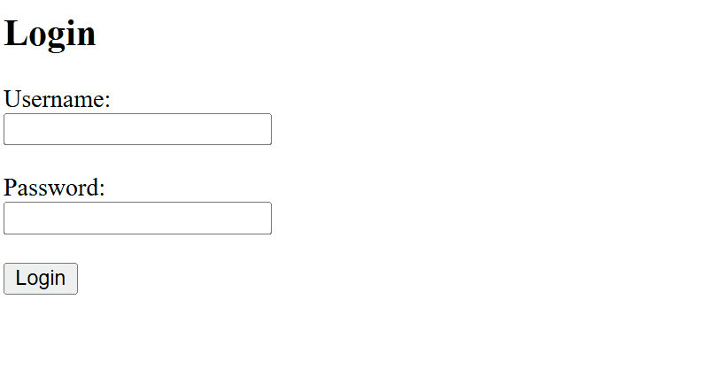
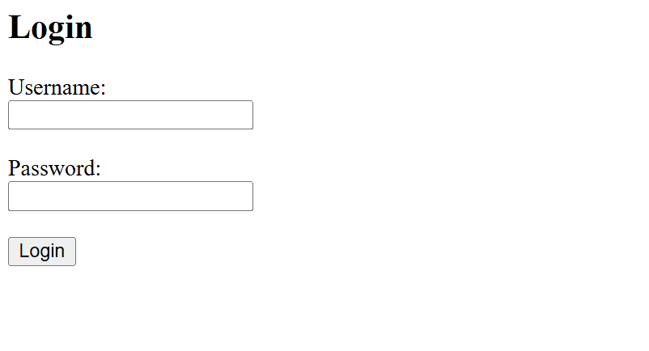
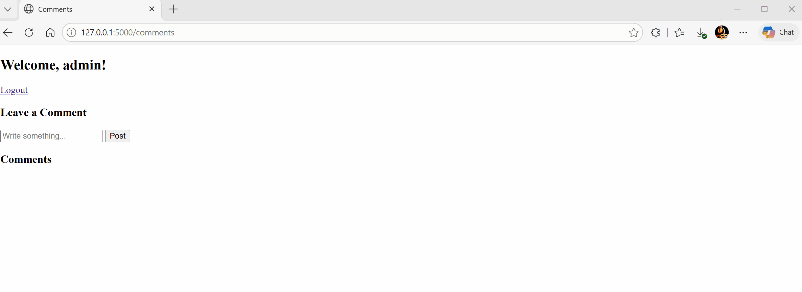
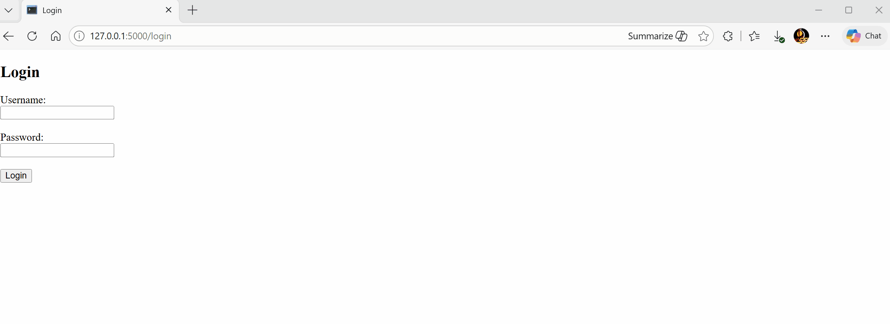

# Vulnerable Web App Lab
### SQL Injection, XSS, and Authentication Flaws

* **Zhibin Wang**
  * [LinkedIn](https://www.linkedin.com/in/zhibin-wang-396318397)
  * [GitHub](https://github.com/xxxbingexxx)

This project demonstrates three core web security vulnerabilities 
by building a deliberately vulnerable web application from scratch. 
For each vulnerability, the project covers the attack, the 
underlying reason it works, and the secure fix with explanation.

The goal was not to build a polished web app — it was to deeply 
understand how real attacks work in practice and be able to 
explain both the vulnerabilities and defenses clearly.

## What You'll Find
- `main` branch — vulnerable implementation
- `secured` branch — fixed implementation  
- `/docs` — tutorial-style documentation explaining each 
  vulnerability, how it was demonstrated, and how it was fixed

## Vulnerabilities Demonstrated

### 1. SQL Injection
* **What it is:** An attack that manipulates a database query by 
  injecting special characters into user input fields, allowing 
  attackers to bypass authentication or extract unauthorized data.
* **How we demonstrated it:** Built a login system using string 
  concatenation, then bypassed it using `admin'--` to eliminate 
  the password check and `' OR '1'='1'--` to log in without 
  any credentials.

  |  |  |
  |:--:|:--:|
  | *Bypassing login with a known username using `admin'--`* | *Bypassing login without any credentials using `' OR '1'='1'--`* |
  
* **The fix:** Parameterized queries. Query structure and user 
  input are sent to the database separately. Input can never 
  change the query's logic no matter what it contains.

### 2. Cross-Site Scripting (XSS)
* **What it is:** An attack where malicious scripts are injected 
  into a website and executed in other users' browsers. Unlike 
  SQL Injection, XSS attacks the browser, not the database.
* **How we demonstrated it:** Disabled Jinja2's auto-escaping 
  with `| safe`, then posted `<script>alert('hacked')</script>` 
  as a comment. The script executed in every visitor's browser.

  |  |  |
  |:--:|:--:|
  | *Injecting malicious JavaScript as a comment* | *Another user's browser executing the injected script* |

* **The fix:** Remove `| safe` and let Jinja2 auto-escape user 
  input. Special characters are converted to harmless text before 
  the browser ever sees them.

### 3. Weak Authentication
* **What it is:** Storing passwords in plaintext means any 
  database breach immediately exposes every user's password. 
  Combined with password reuse, one leaked database can 
  compromise accounts across multiple websites.
* **How we demonstrated it:** Stored `password123` in plaintext. Queried the database directly to 
  show passwords are stored as plain readable text. In practice, 
  an attacker could gain database access through SQL Injection.
* **The fix:** bcrypt hashing. Passwords are transformed before 
  storage using salting and slow computation, making rainbow table 
  and brute force attacks impractical.

## How To Run The Project

### Prerequisites
- Python 3.x — [download here](https://python.org/downloads)

### Installation
```cmd
# Clone the repository
git clone https://github.com/xxxbingexxx/vulnerable-web-app-lab
cd vulnerable-web-app-lab

# Install dependencies
pip install -r requirements.txt
```

### Run the Vulnerable Version
```cmd
# Switch to main branch
git checkout main

# Initialize the database
python database.py

# Start the app
python app.py
```
Visit **http://127.0.0.1:5000** in your browser.

Login credentials:
- Username: `admin`
- Password: `password123`

### Run the Secured Version
```cmd
# Switch to secured branch
git checkout secured

# Reinitialize the database (uses bcrypt hashing)
python database.py

# Start the app
python app.py
```
Visit **http://127.0.0.1:5000** in your browser.

### Try The Attacks
| Attack | Input | Expected Result |
|--------|-------|-----------------|
| SQL Injection | Username: `admin'--` | Vulnerable: success, Secured: fail |
| SQL Injection | Username: `' OR '1'='1'--` | Vulnerable: success, Secured: fail |
| XSS | Comment: `<script>alert('hacked')</script>` | Vulnerable: popup, Secured: plain text |

## Key Security Takeaways

* **Never trust user input.** User input should always be treated 
  as potentially malicious. Trusting input blindly allows attackers 
  to manipulate your application's logic: bypassing authentication, 
  extracting database contents, or even injecting code that executes in 
  other users' browsers.

* **Separate code from data.** The root cause of SQL Injection is 
  mixing user input with code. Parameterized queries fix this by 
  keeping them in completely separate channels. User input can 
  never change the query's logic no matter what it contains.

* **Escape before rendering.** The root cause of XSS is rendering 
  user input as code instead of text. Always escape user input 
  before displaying it. What looks like harmless text to you 
  could be executable JavaScript to a browser.

* **Never store plaintext passwords.** A database breach is bad. 
  A database breach with plaintext passwords is catastrophic. 
  Every user's password is immediately readable and usable on 
  every other site they use the same password on. Always hash 
  with bcrypt.

* **Attacks chain together.** The most dangerous scenarios combine 
  multiple vulnerabilities. SQL Injection can expose a database 
  full of plaintext passwords, which then compromise users across 
  every site they use the same password on. Security is only as 
  strong as its weakest layer.